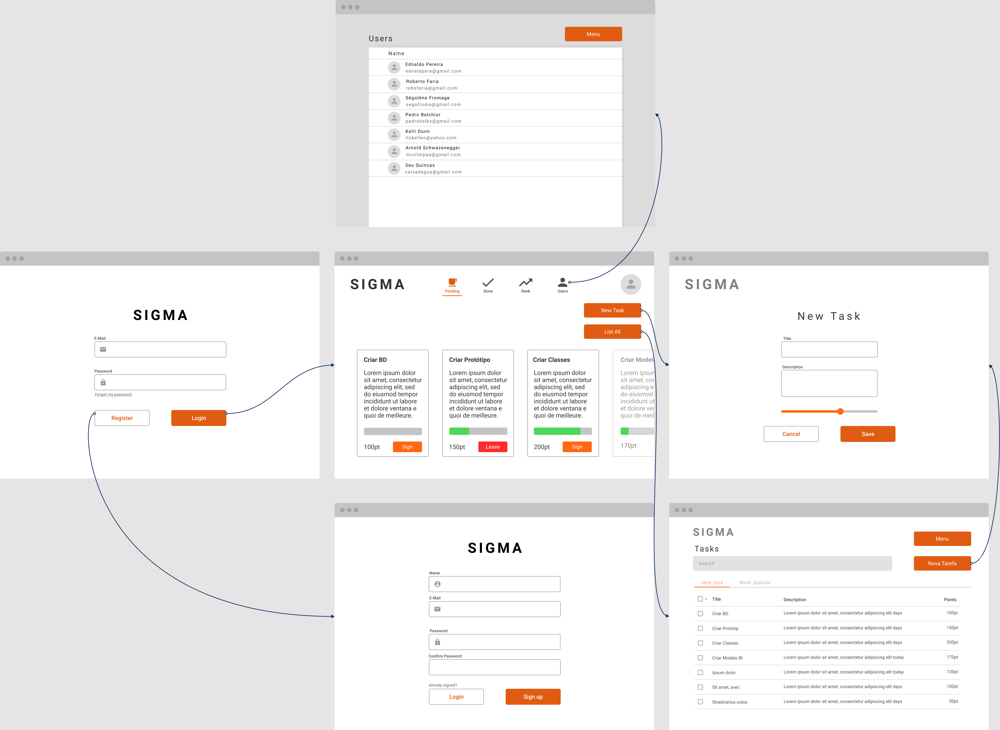

# Epic Task - Check Point 2 - Projeto Parcial

### 💫Integrantes

- RM: 84372 - Paulo Fernando Moncaio Avelar Muniz (2TDSG)
- RM: 85708 - Diogo Amaral (2TDSG)
- RM: 85937 - Gustavo Pereira dos Santos (2TDSG)
- RM: 85385 - Laura Luz Cabral (2TDSR)
- RM: 85164 - Lucas de Castro Pereira (2TDSR)
- RM: 85824 - Víctor Madrid Davanço (2TDSG)

### 🛠 Protótipo

------
#### [protótipo figma](https://www.figma.com/file/RjzKhAYv0Mir6jHOhDqtjA/SIGMA-Epic-Task?node-id=0%3A1)

